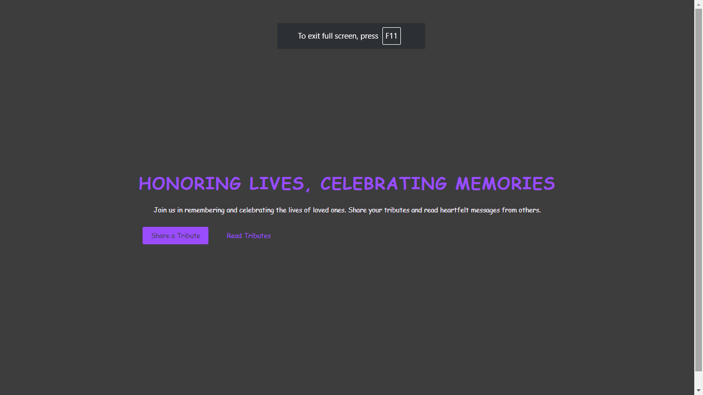

# Obituary Platform

Welcome to the Obituary Platform project repository. This project aims to provide a platform for submitting, managing, and viewing obituaries in a user-friendly manner. Users can submit obituaries, view existing obituaries, and share them on social media.

## Table of Contents

1. [Features](#features)
2. [Installation](#installation)
3. [Usage](#usage)
4. [Contributing](#contributing)
5. [License](#license)

## Features <a name="features"></a>

- **Submit Obituary**: Users can submit obituaries using a form.
- **View Obituaries**: Browse through a list of submitted obituaries.
- **Social Media Sharing**: Share obituaries on Facebook and Twitter.
- **Responsive Design**: The platform is designed to be responsive across different devices.
- **Structured Data**: Implements schema.org for better search engine visibility.

## Installation <a name="installation"></a>

To run the Obituary Platform locally, follow these steps:

1. **Clone the repository**:
   ```
   git clone https://github.com/TheODDYSEY/Obituary-Platform
   cd obituary-platform
   ```

2. **Install dependencies**:
   ```
   pip install -r requirements.txt
   ```

3. **Set up the database**:
   ```
   python manage.py migrate
   ```

4. **Create a superuser** (optional, for admin access):
   ```
   python manage.py createsuperuser
   ```

5. **Run the development server**:
   ```
   python manage.py runserver
   ```

6. **Access the application**:
   Open your web browser and go to `http://localhost:8000` to view the Obituary Platform.

## Usage <a name="usage"></a>

### Submitting an Obituary

1. Click on **Submit an Obituary** from the homepage.
2. Fill out the form with the required details: Name, Date of Birth, Date of Death, Content, and Author.
3. Click **Submit** to add the obituary to the platform.

### Viewing Obituaries

1. Click on **View Obituaries** from the homepage.
2. Browse through the list of obituaries displayed in a table format.
3. Optionally, share obituaries on Facebook or Twitter using the provided links.

### Admin Access

- Access the Django admin interface at `http://localhost:8000/admin/` (login with superuser credentials).
- Manage obituaries and user submissions from the admin dashboard.

## Contributing <a name="contributing"></a>

Contributions are welcome! If you'd like to contribute to the Obituary Platform, please follow these steps:

1. Fork the repository and clone it locally.
2. Create a new branch for your feature or bug fix: `git checkout -b feature-name`.
3. Make your changes and commit them: `git commit -am 'Add new feature'`.
4. Push to your branch: `git push origin feature-name`.
5. Submit a pull request detailing your changes.

## License <a name="license"></a>

This project is licensed under the MIT License - see the [LICENSE](LICENSE) file for details.

---

### Screenshots

Include screenshots here to visually demonstrate the functionality and design of your platform. For example:

- **Homepage**
  

- **Submit Obituary Form**
  

- **View Obituaries Table**
  